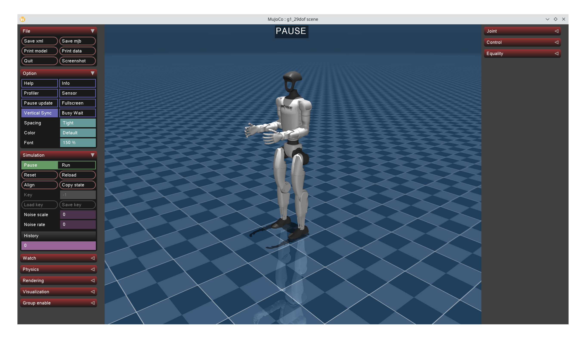

# Unitree G1 Simulator



This is a fork of the original project: [unitree_mujoco](https://github.com/unitreerobotics/unitree_mujoco).
I created this fork mainly for personal use and experimentation.

## Quick Start
1. Install [pixi](https://pixi.sh/dev/installation)
2. Run
    ```bash
    # Clone project
    git clone https://github.com/Aurainting/G1-Simulator.git

    # Enter project
    cd G1-Simulator
    
    # Update submodule
    git submodule update --init --recursive
   
    # Install dependencies
    pixi install
    
    # Run
    pixi run start
    ```
